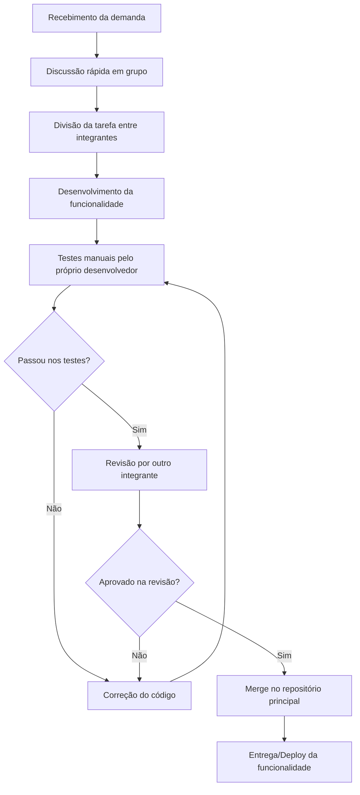

# Aula 14 — Qualidade de Processo — LocalEats

**Disciplina:** Qualidade de Software — Centro Universitário Senac-RS
**Prof.:** Luciano Zanuz
**Sistema em análise:** [LocalEats](https://local-eats-unisenac.vercel.app/)

## 1. Mapeamento do Processo Atual

O fluxo abaixo representa como a equipe desenvolve e valida novas
funcionalidades do LocalEats, desde o recebimento da demanda até a entrega.

O diagrama mostra que o processo é iterativo: sempre que um teste ou uma
revisão reprova, o fluxo retorna para a etapa de correção antes de seguir
adiante.

---

## 2. Identificação de Entradas, Atividades e Saídas

| Etapa | Entrada | Atividade | Saída |
|---|---|---|---|
| Recebimento da demanda | Solicitação do professor/PBL | Leitura e interpretação do enunciado | Entendimento compartilhado da tarefa |
| Divisão de tarefas | Lista de funcionalidades a implementar | Distribuição entre os integrantes | Responsáveis definidos por tarefa |
| Desenvolvimento | Requisito da funcionalidade | Implementação do código | Código-fonte da funcionalidade |
| Testes manuais | Código implementado | Execução manual dos cenários principais | Registro de aprovação ou falha |
| Revisão por pares | Código + resultado dos testes | Leitura crítica do código por outro integrante | Aprovação ou solicitação de ajustes |
| Entrega | Código revisado e aprovado | Merge e publicação da versão | Funcionalidade disponível no sistema |

---

## 3. Reflexão sobre o Processo

**1. O processo utilizado pela equipe está claramente definido?**
Parcialmente. As etapas gerais (desenvolver, testar, revisar, entregar) são
conhecidas pelo grupo, mas não existe um documento formal descrevendo o
fluxo — ele é seguido de forma combinada verbalmente.

**2. Todos os integrantes seguem o mesmo fluxo de trabalho?**
Na maior parte das vezes sim, mas a etapa de "testes manuais" costuma ser
executada com profundidade diferente entre os integrantes, dependendo do
tempo disponível de cada um.

**3. Em quais etapas a qualidade é verificada?**
Principalmente em duas etapas: durante os testes manuais realizados pelo
próprio desenvolvedor e durante a revisão por outro integrante antes do
merge.

**4. Quais melhorias poderiam tornar o processo mais eficiente?**
Padronizar um checklist mínimo de testes antes da revisão, e adotar testes
automatizados (como os já aplicados nas aulas de TDD/BDD) para reduzir a
dependência de verificação manual.

**5. Como a qualidade do processo impacta a qualidade do produto final?**
Um processo com etapas de teste e revisão bem definidas reduz a chance de
defeitos chegarem à entrega final. Quando essas etapas são feitas de forma
inconsistente, o risco de bugs no LocalEats aumenta, mesmo que o código em
si pareça funcional a princípio.
